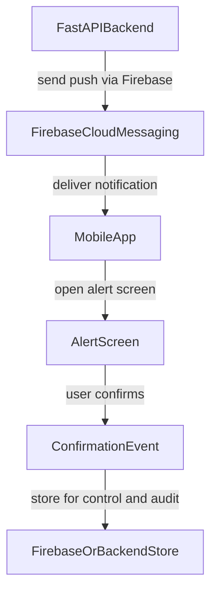

# MMI Emergency App (PwD-first) / App de Emergencia MMI (foco em PcD)

## PT-BR

### Visao geral

Aplicativo mobile de alerta de emergencia com foco em acessibilidade para pessoas com deficiencia (PcD), desenvolvido com Expo + React Native + TypeScript. O fluxo atual permite simular acionamento, executar protocolo visual/sonoro/tatil e confirmar recebimento da mensagem.

### Objetivos do produto

- Entregar alertas criticos com redundancia de canais (visual, audio e vibracao).
- Garantir usabilidade para diferentes perfis de acessibilidade.
- Manter o app simples (sem login) para reduzir friccao em contexto de emergencia.

### Funcionalidades atuais

- Tela inicial com entrada para simulacao de acionamento e laboratorio de hardware.
- Tela de confirmacao por deslizamento para evitar disparo acidental.
- Tela de alerta ativo com:
  - som de alerta em loop,
  - vibracao recorrente,
  - pisca da lanterna,
  - abertura de protocolo detalhado.
- Modal de protocolo com leitura por voz (TTS), pausar/continuar audio e confirmacao do alerta.
- Tela de testes para validar vibracao, audio, TTS e lanterna.
- Modo de alto contraste.

### Fluxo do aplicativo (atual)

1. `index` -> usuario inicia simulacao.
2. `acionamento` -> usuario confirma o disparo.
3. `alert` -> alerta ativo (audio + haptico + lanterna).
4. `EmergencyProtocolModal` -> usuario le/ouve mensagem e confirma.
5. retorno para `index`.

### Arquitetura tecnica

- Roteamento por arquivos com Expo Router.
- Layout raiz em `src/app/_layout.tsx`.
- Providers globais:
  - `ThemeProvider`: tema normal/alto contraste.
  - `TorchProvider`: estado e permissao de lanterna/camera.
  - `AudioProvider`: alarme e TTS.
- Telas em `src/app`.
- Componentes reutilizaveis em `src/components`.
- Servicos de hardware em `src/services`.
- Estilos em `src/styles`.
- Dominio de alertas em `src/features/alerts`.

### Comandos de desenvolvimento

- `npm run start` -> inicia Expo.
- `npm run android` -> executa em Android.
- `npm run ios` -> executa em iOS.
- `npm run web` -> executa no navegador.
- `npm run lint` -> roda lint.
- `npm run build:android` -> build EAS Android.
- `npm run build:ios` -> build EAS iOS.

### Acessibilidade: implementado hoje

- Botao base com `accessibilityRole`, estado de desabilitado/carregando e labels/hints.
- Modal com `accessibilityViewIsModal` e anuncio via `AccessibilityInfo.announceForAccessibility`.
- Modo de alto contraste em nivel de tema.
- Escalonamento de fonte em componentes criticos do modal.

### Acessibilidade: melhorias priorizadas

1. Corrigir semantica de containers para nao ocultar controles internos de leitores de tela.
2. Tornar o controle de deslizamento operavel via acoes de acessibilidade (sem gesto obrigatorio).
3. Marcar titulos principais com papel de cabecalho (`accessibilityRole=\"header\"`).
4. Reduzir cores fixas e priorizar tokens de tema para contraste consistente.
5. Adicionar rotina de verificacao de foco ao abrir/fechar modal.

### Roadmap: Firebase + FastAPI (futuro)

Escopo futuro previsto para notificacao push, sem autenticacao de usuario:

Diretrizes:

- Sem login/autenticacao no app.
- Disparo de push sera feito pelo backend FastAPI ja existente.
- Confirmacao do usuario sera persistida para controle e informacao operacional.
- Integracao deve preservar o foco em acessibilidade e baixa friccao.

### Plano inicial de refatoracao (fase 1)

Checklist de execucao:

- [x] Criar base de documentacao unificada no `README.md`.
- [x] Centralizar constantes e tipos de alerta em modulo de dominio.
- [x] Remover duplicacao de payload/mensagem entre tela de alerta e modal.
- [x] Criar estrutura de copy inicial preparada para i18n.
- [x] Corrigir pontos criticos de acessibilidade (semantica de card, slider acessivel, titulos).
- [x] Ajustar componentes para maior reutilizacao e melhor contraste.
- [ ] Fase 2: integrar entrada de notificacoes Firebase.
- [ ] Fase 2: persistir confirmacao de alerta no backend/storage definido.

---

## EN

### Overview

Mobile emergency alert app focused on accessibility for people with disabilities (PwD), built with Expo + React Native + TypeScript. The current flow supports alert simulation, visual/audio/haptic protocol triggering, and user acknowledgment.

### Product goals

- Deliver critical alerts with redundant channels (visual, audio, vibration).
- Keep interactions accessible for different user needs.
- Keep the app simple (no login) to reduce friction during emergencies.

### Current features

- Home screen with alert simulation and hardware lab access.
- Slide-to-confirm screen to prevent accidental trigger.
- Active alert screen with:
  - looping alarm sound,
  - recurring haptics,
  - torch flashing,
  - protocol opening action.
- Protocol modal with TTS playback, pause/resume, and acknowledgment.
- Test screen to validate vibration, sound, TTS, and torch.
- High-contrast mode.

### Current application flow

1. `index` -> user starts simulation.
2. `acionamento` -> user confirms trigger.
3. `alert` -> active alert (audio + haptics + torch).
4. `EmergencyProtocolModal` -> user reads/listens and confirms.
5. returns to `index`.

### Technical architecture

- File-based routing with Expo Router.
- Root shell in `src/app/_layout.tsx`.
- Global providers:
  - `ThemeProvider`: regular/high-contrast themes.
  - `TorchProvider`: torch/camera permission and state.
  - `AudioProvider`: alarm and TTS lifecycle.
- Screens in `src/app`.
- Reusable components in `src/components`.
- Hardware services in `src/services`.
- Styles in `src/styles`.
- Alert domain modules in `src/features/alerts`.

### Development commands

- `npm run start` -> start Expo.
- `npm run android` -> run on Android.
- `npm run ios` -> run on iOS.
- `npm run web` -> run in browser.
- `npm run lint` -> run linting.
- `npm run build:android` -> EAS Android build.
- `npm run build:ios` -> EAS iOS build.

### Accessibility: currently implemented

- Shared button with semantic role, busy/disabled states, and labels/hints.
- Modal configured with `accessibilityViewIsModal` and screen-reader announcements.
- Theme-level high-contrast mode.
- Font scaling in critical modal text.

### Accessibility: prioritized improvements

1. Fix container semantics so nested controls remain reachable by screen readers.
2. Make slider fully operable via accessibility actions (no gesture-only dependency).
3. Mark key screen titles as headers (`accessibilityRole=\"header\"`).
4. Replace hardcoded colors with theme-driven tokens where possible.
5. Improve focus management routines when opening/closing modal content.

### Future roadmap: Firebase + FastAPI

Planned future scope for push-notification based alert delivery, without authentication:

- No login/authentication in app scope.
- Push will be triggered by an existing external FastAPI backend.
- User acknowledgment will be persisted for informational and control tracking.
- Accessibility-first interaction model remains mandatory.

### Initial refactor plan (phase 1)

- Documentation baseline completed in this README.
- Alert payload/types centralized for reuse.
- Alert message duplication reduced across screen and modal.
- Initial i18n-ready copy structure introduced.
- High-impact accessibility fixes applied in UI flow.
