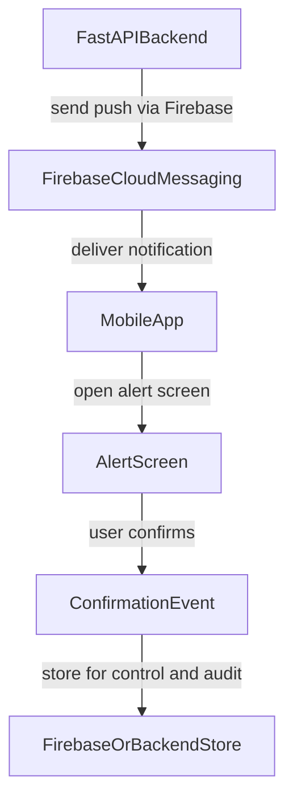

# MMI Emergency App (PwD-first) / App de Emergencia MMI (foco em PcD)

## PT-BR

### Visao geral e proposito

Aplicativo **mobile** de alerta de emergencia, com foco em **acessibilidade para pessoas com deficiencia (PcD)**, no contexto de **acompanhamento de canteiro de mineracao e arredores**. O proposito e oferecer um canal **complementar e pratico** a um ecossistema que ja notifica as pessoas por outros meios (ex.: **PWA**, **SMS**, **e-mail**, **notificacao interna** e **WhatsApp**). Este app **nao substitui** canais oficiais de defesa civil ou de broadcast publico; reforca o alcance e a experiencia (push rico, TTS, alto contraste) para quem instala o app.

Stack: Expo + React Native + TypeScript. O fluxo suporta push (dados FCM/Expo), simulacao local, protocolo visual/sonoro/tatil e confirmacao da mensagem.

### Objetivos do produto

- Complementar o sistema de alerta existente com notificacoes **nativas** e um fluxo acessivel.
- Entregar alertas criticos com redundancia de canais (visual, audio e vibracao).
- Garantir usabilidade para diferentes perfis de acessibilidade.
- Manter o app simples (sem login) para reduzir friccao em contexto de emergencia.

### Funcionalidades atuais

- Tela inicial com simulacao de alerta e laboratorio de hardware.
- Tela de alerta ativo com:
  - som de alerta em loop,
  - vibracao recorrente,
  - pisca da lanterna,
  - abertura de protocolo detalhado.
- Modal de protocolo com leitura por voz (TTS), pausar/continuar audio e confirmacao do alerta.
- Tela de testes para validar vibracao, audio, TTS e lanterna.
- Modo de alto contraste.
- Notificacoes (Android): canal `emergency` (constante `EMERGENCY_NOTIFICATION_CHANNEL_ID` em `src/features/alerts/pushConstants.ts`), permissao `POST_NOTIFICATIONS`. Com **dados** validos (`parseEmergencyAlertData` em `src/features/alerts/parseNotificationPayload.ts`), o app navega para `alert` ao **tocar** na notificacao, ao **abrir o app a partir dela** (inicio a frio) ou em **primeiro plano** (`useEmergencyNotifications` em `src/hooks/useEmergencyNotifications.ts` + `NotificationBootstrap` em `src/components/system/NotificationBootstrap.tsx`). Com o app em **background ou encerrado**, o painel do SO mostra a notificacao; em geral e preciso **tocar** para abrir a tela de alerta (comportamento normal do iOS/Android).

**Expo Go (Android, SDK 53+):** o modulo de push nao e carregado no Expo Go nesse cenario; use **dev build** (`npx expo run:android` ou build EAS perfil `development`).

### Fluxo do aplicativo (atual)

1. `index` -> simulacao opcional ou aguarda push.
2. `alert` -> alerta ativo (audio + haptico + lanterna).
3. `EmergencyProtocolModal` -> usuario le/ouve mensagem e confirma.
4. retorno para `index`.

### Como testar o app (checklist)

1. **Dependencias:** Node.js, `npm install` na raiz do repositorio.
2. **Dispositivo Android (push real):** use **development build** — `npm run android` (equivale a `expo run:android`) apos `npm run start` na mesma versao, ou instale um APK/AAB gerado no EAS. **Nao** use Expo Go no Android se o objetivo e testar FCM/Expo push.
3. **Permissoes:** ao abrir o app, aceite notificacoes. Sem isso, nao ha token de push.
4. **EAS + FCM v1 (uma vez por perfil de build):** `eas login` e `eas credentials -p android` → escolha o **mesmo perfil** do build que esta no telefone (ex. `development` vs `production`) → **Push Notifications (FCM V1): Google Service Account Key** — envie o JSON da **conta de servico** do Google Cloud (Firebase **Admin** / mesmo projeto do `google-services.json`). **Nao** use `google-services.json` no lugar do JSON de conta de serviço. A linha *Submissions: Google Service Account Key for Play Store* e **outra** coisa (publicacao na Play) e nao e obrigatoria para push. Doc: [Expo — push e FCM](https://docs.expo.dev/push-notifications/push-notifications-setup/).
5. **Token Expo Push:** com o app em execucao, o token aparece no log do Metro (dev) como `ExponentPushToken[...]`. Copie a **string inteira** (incluindo o prefixo).
6. **Enviar teste (Expo Push API):** na raiz do repo:
   ```bash
   EXPO_PUSH_TOKEN="ExponentPushToken[SEU_TOKEN_AQUI]" npm run push:test
   ```
   Scripts equivalentes: `node scripts/send-expo-test-push.mjs` ou `./scripts/send-expo-test-push.sh`.
7. **Sucesso na API:** HTTP **200** e corpo com `"status": "ok"`. Se vier `InvalidCredentials` / "Unable to retrieve the FCM server key", faltou ou esta errado o passo 4 no **mesmo** projectId/owner EAS.
8. **Comportamento no aparelho:** em **primeiro plano**, o app pode ir direto para `alert` ao receber o push; em **background/lock**, em geral aparece a notificacao e o usuario **toca** para abrir o app na tela de alerta.
9. **Texto no painel vs no modal:** o script de teste `scripts/send-expo-test-push.mjs` envia `title`/`body` (bandeja) e `data.title` / `data.message` (conteudo usado no fluxo de alerta). Voce pode encurtar o texto do painel e manter o protocolo longo no `data`.
10. **Seguranca:** nao commite chaves (JSON de conta de serviço, tokens). O `.gitignore` ja pode listar o arquivo local da chave; gire a chave se vazar.

### Push (Expo + Firebase `pcd-msg-push`)

- Pacote / bundle id: `com.mmi.mineradora.emergencia` (alinhado a `google-services.json` e a `app.json` → `android.package` / `ios.bundleIdentifier`).
- **Projeto EAS / Expo:** `slug` `mmi-mineradora`, `owner` @gustavo.sipremo, **projectId** em `app.json` → `extra.eas.projectId` (necessario para `getExpoPushTokenAsync`).
- Perfis de build em `eas.json`: `development` (dev client), `preview` (APK interno), `production` (AAB). Credenciais FCM v1 sao **por aplicativo/perfil** no fluxo do EAS; configure cada perfil que voce usar em dispositivo.
- `npx expo prebuild --clean --platform android` quando alterar plugins / `app.json` relevantes a nativo.
- Payload de **dados** esperado (strings; `title` e `message` em `data` sao **obrigatorios** no parser do app):

| Chave | Descricao |
|-------|-----------|
| `level` | Nivel do alerta (opcional; default "Alerta") |
| `structure` | Estrutura/local (opcional; default "-") |
| `title` | Titulo (exibido no protocolo) |
| `message` | Texto do protocolo |
| `isSimulation` | `"true"` / `"false"` |
| `isEfni` | `"true"` / `"false"` |

- No Android, mensagens FCM/Expo devem usar o canal `emergency` (alinhado ao `defaultChannel` do plugin `expo-notifications` em `app.json`).

**Nota:** o teste com `exp.host` usa o **Expo Push Token**, nao o "token de registro" bruto exibido no console Firebase.

### Arquitetura tecnica

- Roteamento por arquivos com Expo Router.
- **Telas:** `src/app/index.tsx`, `alert.tsx`, `tests.tsx`; layout `src/app/_layout.tsx` (inclui `AlertPayloadProvider` e `NotificationBootstrap`).
- Providers globais:
  - `ThemeProvider`: tema normal/alto contraste.
  - `TorchProvider`: estado e permissao de lanterna/camera.
  - `AudioProvider`: alarme e TTS.
- Componentes reutilizaveis em `src/components`.
- Servicos de hardware em `src/services`.
- Estilos em `src/styles`.
- Dominio de alertas em `src/features/alerts`.
- Contexto de payload: `src/context/AlertPayloadContext.tsx`.

### Comandos de desenvolvimento

- `npm run start` -> inicia o bundler Expo.
- `npm run android` -> compila/executa em Android (dev build local).
- `npm run ios` -> compila/executa em iOS.
- `npm run web` -> executa no navegador.
- `npm run lint` -> roda lint.
- `npm run build:android` -> `eas build --platform android`.
- `npm run build:ios` -> `eas build --platform ios`.
- `npm run push:test` -> envia notificacao de teste (requer `EXPO_PUSH_TOKEN`).

### Acessibilidade: implementado hoje

- Botao base com `accessibilityRole`, estado de desabilitado/carregando e labels/hints.
- Modal com `accessibilityViewIsModal` e anuncio via `AccessibilityInfo.announceForAccessibility`.
- Modo de alto contraste em nivel de tema.
- Escalonamento de fonte em componentes criticos do modal.

### Acessibilidade: melhorias priorizadas

1. Corrigir semantica de containers para nao ocultar controles internos de leitores de tela.
2. Tornar o controle de deslizamento operavel via acoes de acessibilidade (sem gesto obrigatorio).
3. Marcar titulos principais com papel de cabecalho (`accessibilityRole=\"header\"`).
4. Reduzir cores fixas e priorizar tokens de tema para contraste consistente.
5. Adicionar rotina de verificacao de foco ao abrir/fechar modal.

### Roadmap: Firebase + FastAPI (futuro)

Escopo futuro previsto para notificacao push, sem autenticacao de usuario:



Diretrizes:

- Sem login/autenticacao no app.
- Disparo de push sera feito pelo backend FastAPI ja existente.
- Confirmacao do usuario sera persistida para controle e informacao operacional.
- Integracao deve preservar o foco em acessibilidade e baixa friccao.

### Plano inicial de refatoracao (fase 1)

Checklist de execucao:

- [x] Criar base de documentacao unificada no `README.md`.
- [x] Centralizar constantes e tipos de alerta em modulo de dominio.
- [x] Remover duplicacao de payload/mensagem entre tela de alerta e modal.
- [x] Criar estrutura de copy inicial preparada para i18n.
- [x] Corrigir pontos criticos de acessibilidade (semantica de card, slider acessivel, titulos).
- [x] Ajustar componentes para maior reutilizacao e melhor contraste.
- [x] Fase 2: integrar entrada de notificacoes Firebase (listener + canal + payload).
- [ ] Fase 2: persistir confirmacao de alerta no backend/storage definido.

---

## EN

### Overview and product purpose

**Mobile** emergency alert app with an accessibility focus for **people with disabilities (PwD)**, intended for a **mine site and surrounding area** context. The purpose is a **convenient, complementary** channel on top of an existing ecosystem that already reaches people (e.g. **PWA**, **SMS**, **email**, **internal notification**, **WhatsApp**). This app does **not** replace official civil-defense or public-broadcast systems; it improves reach and in-app experience (rich push, TTS, high contrast) for users who install it.

Built with Expo + React Native + TypeScript: push (FCM/Expo) data, local simulation, visual/audio/haptic protocol, and user acknowledgment.

### Product goals

- Complement the existing alert stack with **native** notifications and an accessible flow.
- Deliver critical alerts with redundant channels (visual, audio, vibration).
- Keep interactions accessible for different user needs.
- Keep the app simple (no login) to reduce friction during emergencies.

### Current features

- Home screen with alert simulation and hardware lab.
- Active alert screen with:
  - looping alarm sound,
  - recurring haptics,
  - torch flashing,
  - protocol open action.
- Protocol modal with TTS playback, pause/resume, and acknowledgment.
- Test screen to validate vibration, sound, TTS, and torch.
- High-contrast mode.
- Android notifications: `emergency` channel (`EMERGENCY_NOTIFICATION_CHANNEL_ID` in `src/features/alerts/pushConstants.ts`), `POST_NOTIFICATIONS`. With valid **data** (`parseEmergencyAlertData` in `src/features/alerts/parseNotificationPayload.ts`), navigation to `alert` happens on **notification tap**, **open-from-notification (cold start)**, or **foreground receive** via `useEmergencyNotifications` (`src/hooks/useEmergencyNotifications.ts`) and `NotificationBootstrap` (`src/components/system/NotificationBootstrap.tsx`). In **background or killed** state, the OS shows the tray notification; the user usually must **tap** to open the alert screen (expected platform behavior).

**Expo Go (Android, SDK 53+):** the push path is not used in Expo Go; use a **dev build** (`npx expo run:android` or an EAS `development` build).

### Current application flow

1. `index` -> optional simulation or wait for push.
2. `alert` -> active alert (audio + haptics + torch).
3. `EmergencyProtocolModal` -> user reads/listens and confirms.
4. returns to `index`.

### How to test the app (checklist)

1. **Dependencies:** Node.js, `npm install` at the repo root.
2. **Android (real push):** use a **development build** — `npm run android` (`expo run:android`) or install an EAS-built binary. **Do not** rely on **Expo Go** on Android for FCM/Expo push.
3. **Permissions:** allow notifications; otherwise there is no Expo push token.
4. **EAS + FCM v1 (once per build profile):** `eas login` and `eas credentials -p android` → pick the **same profile** as your device build (e.g. `development` vs `production`) → **Push Notifications (FCM V1): Google Service Account Key** — upload the **Google Cloud service account** JSON (Firebase **Admin** / same project as `google-services.json`). Do **not** upload `google-services.json` in place of the service account key. **Submissions: Google Service Account Key for Play Store** is for **Play API submission**, not for push. See [Expo push and FCM](https://docs.expo.dev/push-notifications/push-notifications-setup/).
5. **Expo push token:** in dev, Metro logs `ExponentPushToken[...]`. Copy the **full** string.
6. **Send test (Expo Push API):** from repo root:
   ```bash
   EXPO_PUSH_TOKEN="ExponentPushToken[YOUR_TOKEN_HERE]" npm run push:test
   ```
   Same as `node scripts/send-expo-test-push.mjs` or `./scripts/send-expo-test-push.sh`.
7. **API success:** HTTP **200** and `"status": "ok"`. If you see `InvalidCredentials` / “Unable to retrieve the FCM server key”, step 4 is missing or wrong for this **EAS app/profile**.
8. **On device:** **foreground** may auto-navigate to `alert` on receive; **background/locked** usually requires a **tap** to open the alert flow.
9. **Tray text vs modal:** the sample script `scripts/send-expo-test-push.mjs` sets `title`/`body` (tray) and `data.title` / `data.message` (in-app). Keep tray copy short; put the full protocol in `data`.
10. **Security:** do not commit service account JSON or tokens; rotate keys if they leak. `.gitignore` can ignore local key filenames.

### Push (Expo + Firebase project `pcd-msg-push`)

- Android package / iOS bundle id: `com.mmi.mineradora.emergencia` (matches `google-services.json` and `app.json`).
- **EAS/Expo project:** `slug` `mmi-mineradora`, `owner` @gustavo.sipremo, `extra.eas.projectId` in `app.json` (required for `getExpoPushTokenAsync`).
- `eas.json` build profiles: `development` (dev client), `preview` (internal APK), `production` (AAB). Configure **FCM v1** for each profile you use on devices.
- Re-run `npx expo prebuild --clean --platform android` when native `app.json` / plugins change.
- Expected **data** payload (string fields; in-app `title` and `message` inside **data** are **required** by the parser):

| Key | Purpose |
|-----|---------|
| `level` | Alert level (optional; default "Alerta") |
| `structure` | Site/structure (optional; default "-") |
| `title` | Title shown in protocol |
| `message` | Protocol body |
| `isSimulation` | `"true"` / `"false"` |
| `isEfni` | `"true"` / `"false"` |

- On Android, FCM/Expo messages should use channel `emergency` (align with the `defaultChannel` in the `expo-notifications` plugin in `app.json`).

**Note:** the Expo test uses an **Expo push token**, not the raw FCM registration field from the Firebase console.

### Technical architecture

- File-based routing with Expo Router.
- **Screens:** `src/app/index.tsx`, `alert.tsx`, `tests.tsx`; shell in `src/app/_layout.tsx` (`AlertPayloadProvider`, `NotificationBootstrap`).
- Global providers:
  - `ThemeProvider`: regular/high-contrast themes.
  - `TorchProvider`: torch/camera permission and state.
  - `AudioProvider`: alarm and TTS lifecycle.
- Reusable components in `src/components`.
- Hardware services in `src/services`.
- Styles in `src/styles`.
- Alert domain in `src/features/alerts`.
- Alert payload context: `src/context/AlertPayloadContext.tsx`.

### Development commands

- `npm run start` -> start Expo dev server.
- `npm run android` -> run on Android (local dev build).
- `npm run ios` -> run on iOS.
- `npm run web` -> run in browser.
- `npm run lint` -> run ESLint.
- `npm run build:android` -> EAS Android build.
- `npm run build:ios` -> EAS iOS build.
- `npm run push:test` -> send test notification (requires `EXPO_PUSH_TOKEN`).

### Accessibility: currently implemented

- Shared button with semantic role, busy/disabled states, and labels/hints.
- Modal configured with `accessibilityViewIsModal` and screen-reader announcements.
- Theme-level high-contrast mode.
- Font scaling in critical modal text.

### Accessibility: prioritized improvements

1. Fix container semantics so nested controls remain reachable by screen readers.
2. Make slider fully operable via accessibility actions (no gesture-only dependency).
3. Mark key screen titles as headers (`accessibilityRole=\"header\"`).
4. Replace hardcoded colors with theme-driven tokens where possible.
5. Improve focus management routines when opening/closing modal content.

### Future roadmap: Firebase + FastAPI

Planned future scope for push-based alerts, without authentication:

- No login in app scope.
- Push triggered from an existing external FastAPI backend.
- User acknowledgment stored for operations and audit.
- Accessibility-first interaction model.

### Initial refactor plan (phase 1)

- Documentation baseline in this README (see PT-BR and EN).
- Centralized alert payload/types.
- Reduced duplication between alert screen and modal.
- i18n-ready copy structure.
- High-impact accessibility fixes in UI.
- Fase 2: backend persistence for acknowledgments (pending).
