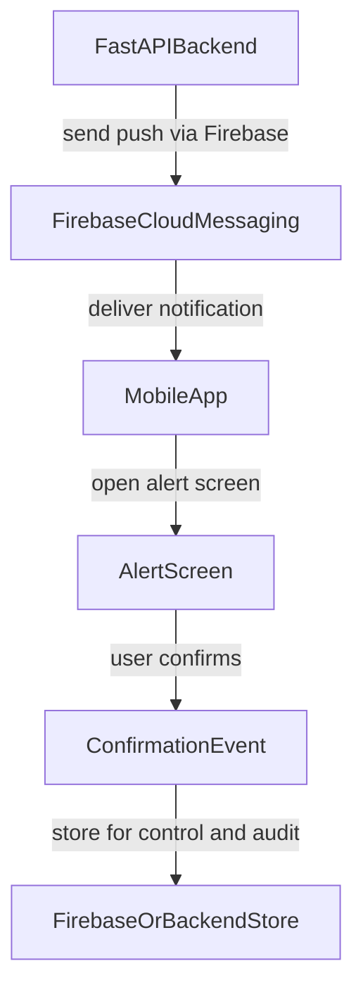

# MMI Emergency App (PwD-first) / App de Emergencia MMI (foco em PcD)

## PT-BR

### Visao geral

Aplicativo mobile de alerta de emergencia com foco em acessibilidade para pessoas com deficiencia (PcD), desenvolvido com Expo + React Native + TypeScript. O fluxo suporta alerta por notificacao push (dados FCM), simulacao local, protocolo visual/sonoro/tatil e confirmacao da mensagem.

### Objetivos do produto

- Entregar alertas criticos com redundancia de canais (visual, audio e vibracao).
- Garantir usabilidade para diferentes perfis de acessibilidade.
- Manter o app simples (sem login) para reduzir friccao em contexto de emergencia.

### Funcionalidades atuais

- Tela inicial com simulacao de alerta e laboratorio de hardware.
- Tela de alerta ativo com:
  - som de alerta em loop,
  - vibracao recorrente,
  - pisca da lanterna,
  - abertura de protocolo detalhado.
- Modal de protocolo com leitura por voz (TTS), pausar/continuar audio e confirmacao do alerta.
- Tela de testes para validar vibracao, audio, TTS e lanterna.
- Modo de alto contraste.
- Notificacoes (Android): canal `emergency`, permissao `POST_NOTIFICATIONS`; ao tocar na notificacao ou receber em primeiro plano (com dados validos), o app abre `alert`.

### Fluxo do aplicativo (atual)

1. `index` -> simulacao opcional ou aguarda push.
2. `alert` -> alerta ativo (audio + haptico + lanterna).
3. `EmergencyProtocolModal` -> usuario le/ouve mensagem e confirma.
4. retorno para `index`.

### Push (Expo + Firebase `pcd-msg-push`)

- Pacote Android: `com.mmi.mineradora.emergencia` (alinhado a `google-services.json`).
- EAS: projeto `mmi-mineradora`, `owner` @gustavo.sipremo, **projectId** em `app.json` → `extra.eas.projectId` (já vinculado). Arquivo `eas.json` presente para builds.
- **FCM (release, manual):** execute `eas credentials -p android`, escolha o perfil (ex.: `production`), abra **Google Service Account** / push credentials e carregue a **chave de conta de serviço (JSON) do Google Cloud** com permissão de envio FCM (v1), no mesmo projeto do Firebase. Veja: [Expo: FCM / push](https://docs.expo.dev/push-notifications/push-notifications-setup/).
- `npx expo prebuild --clean --platform android` já pode ter sido usado após alterar plugins; use de novo se mudar `app.json` + plugins.
- Payload de **dados** esperado (campos string; `title` e `message` obrigatorios):

| Chave | Descricao |
|-------|-----------|
| `level` | Nivel do alerta (opcional; default "Alerta") |
| `structure` | Estrutura/local (opcional; default "-") |
| `title` | Titulo curto |
| `message` | Texto do protocolo |
| `isSimulation` | `"true"` / `"false"` |
| `isEfni` | `"true"` / `"false"` |

- No Android, use `android.channel_id` = `emergency` nas mensagens FCM para casar com o canal criado no app.

**Teste rapido (Expo Push API, nao e o campo FCM do console Firebase):** copie o token completo do log Metro (`ExponentPushToken[...]`), depois na raiz do repo:

```bash
EXPO_PUSH_TOKEN="ExponentPushToken[SEU_TOKEN]" node scripts/send-expo-test-push.mjs
# ou: EXPO_PUSH_TOKEN="..." npm run push:test
# ou: EXPO_PUSH_TOKEN="..." ./scripts/send-expo-test-push.sh
```

Resposta esperada: HTTP 200 e JSON com `"status": "ok"` (ou um recibo `ok` por destino). Com o app em dev build, o alerta pode abrir em primeiro plano; em background, abra a partir da notificacao.

Se aparecer `InvalidCredentials` / “Unable to retrieve the FCM server key”, o **Expo** ainda nao tem credenciais FCM do seu projeto Google: rode `eas credentials -p android` e configure **FCM (HTTP v1)** com a conta de servico do mesmo projeto Firebase (`pcd-msg-push`). Sem isso, a API `exp.host` aceita o pedido mas nao entrega no dispositivo Android.

### Arquitetura tecnica

- Roteamento por arquivos com Expo Router.
- Layout raiz em `src/app/_layout.tsx`.
- Providers globais:
  - `ThemeProvider`: tema normal/alto contraste.
  - `TorchProvider`: estado e permissao de lanterna/camera.
  - `AudioProvider`: alarme e TTS.
- Telas em `src/app`.
- Componentes reutilizaveis em `src/components`.
- Servicos de hardware em `src/services`.
- Estilos em `src/styles`.
- Dominio de alertas em `src/features/alerts`.
- `AlertPayloadProvider` + listener em `NotificationBootstrap` (`expo-notifications`).

### Comandos de desenvolvimento

- `npm run start` -> inicia Expo.
- `npm run android` -> executa em Android.
- `npm run ios` -> executa em iOS.
- `npm run web` -> executa no navegador.
- `npm run lint` -> roda lint.
- `npm run build:android` -> build EAS Android.
- `npm run build:ios` -> build EAS iOS.

### Acessibilidade: implementado hoje

- Botao base com `accessibilityRole`, estado de desabilitado/carregando e labels/hints.
- Modal com `accessibilityViewIsModal` e anuncio via `AccessibilityInfo.announceForAccessibility`.
- Modo de alto contraste em nivel de tema.
- Escalonamento de fonte em componentes criticos do modal.

### Acessibilidade: melhorias priorizadas

1. Corrigir semantica de containers para nao ocultar controles internos de leitores de tela.
2. Tornar o controle de deslizamento operavel via acoes de acessibilidade (sem gesto obrigatorio).
3. Marcar titulos principais com papel de cabecalho (`accessibilityRole=\"header\"`).
4. Reduzir cores fixas e priorizar tokens de tema para contraste consistente.
5. Adicionar rotina de verificacao de foco ao abrir/fechar modal.

### Roadmap: Firebase + FastAPI (futuro)

Escopo futuro previsto para notificacao push, sem autenticacao de usuario:



Diretrizes:

- Sem login/autenticacao no app.
- Disparo de push sera feito pelo backend FastAPI ja existente.
- Confirmacao do usuario sera persistida para controle e informacao operacional.
- Integracao deve preservar o foco em acessibilidade e baixa friccao.

### Plano inicial de refatoracao (fase 1)

Checklist de execucao:

- [x] Criar base de documentacao unificada no `README.md`.
- [x] Centralizar constantes e tipos de alerta em modulo de dominio.
- [x] Remover duplicacao de payload/mensagem entre tela de alerta e modal.
- [x] Criar estrutura de copy inicial preparada para i18n.
- [x] Corrigir pontos criticos de acessibilidade (semantica de card, slider acessivel, titulos).
- [x] Ajustar componentes para maior reutilizacao e melhor contraste.
- [x] Fase 2: integrar entrada de notificacoes Firebase (listener + canal + payload).
- [ ] Fase 2: persistir confirmacao de alerta no backend/storage definido.

---

## EN

### Overview

Mobile emergency alert app focused on accessibility for people with disabilities (PwD), built with Expo + React Native + TypeScript. The flow supports push-driven alerts (FCM data), local simulation, visual/audio/haptic protocol triggering, and user acknowledgment.

### Product goals

- Deliver critical alerts with redundant channels (visual, audio, vibration).
- Keep interactions accessible for different user needs.
- Keep the app simple (no login) to reduce friction during emergencies.

### Current features

- Home screen with alert simulation and hardware lab access.
- Active alert screen with:
  - looping alarm sound,
  - recurring haptics,
  - torch flashing,
  - protocol opening action.
- Protocol modal with TTS playback, pause/resume, and acknowledgment.
- Test screen to validate vibration, sound, TTS, and torch.
- High-contrast mode.
- Android notifications: `emergency` channel, `POST_NOTIFICATIONS`; valid `data` opens the `alert` screen (tap or foreground).

### Current application flow

1. `index` -> optional simulation or wait for push.
2. `alert` -> active alert (audio + haptics + torch).
3. `EmergencyProtocolModal` -> user reads/listens and confirms.
4. returns to `index`.

### Push (Expo + Firebase project `pcd-msg-push`)

- Android application id: `com.mmi.mineradora.emergencia` (matches `google-services.json`).
- EAS: app `mmi-mineradora`, `extra.eas.projectId` is set (project linked). `eas.json` is present for builds.
- **FCM (release, one-time manual):** run `eas credentials -p android`, pick a profile (e.g. `production`), add **FCM v1** using a **Google Cloud service account JSON** with FCM send access (same Firebase/GCP project). See [Expo push setup](https://docs.expo.dev/push-notifications/push-notifications-setup/).
- Re-run `npx expo prebuild --clean --platform android` after native-relevant `app.json` / plugin changes.
- Expected **data** payload (string fields; `title` and `message` required):

| Key | Purpose |
|-----|---------|
| `level` | Alert level (optional; default "Alerta") |
| `structure` | Site/structure (optional; default "-") |
| `title` | Short title |
| `message` | Protocol body |
| `isSimulation` | `"true"` / `"false"` |
| `isEfni` | `"true"` / `"false"` |

- On Android, set FCM `android.channel_id` to `emergency` to match the app channel.

**Quick test (Expo Push API, not the Firebase console FCM token field):** copy the full token from Metro (`ExponentPushToken[...]`), then from the repo root:

```bash
EXPO_PUSH_TOKEN="ExponentPushToken[YOUR_TOKEN]" node scripts/send-expo-test-push.mjs
# or: EXPO_PUSH_TOKEN="..." npm run push:test
# or: EXPO_PUSH_TOKEN="..." ./scripts/send-expo-test-push.sh
```

Expect HTTP 200 and JSON with `"status": "ok"` (or per-ticket receipts). On a **development build**, the alert may open while foregrounded; if the app is in the background, open the notification to trigger the same flow.

If you see `InvalidCredentials` / “Unable to retrieve the FCM server key”, **Expo** does not have your Google FCM credentials yet: run `eas credentials -p android` and add **FCM (HTTP v1)** using a service account JSON from the same Firebase/GCP project as `google-services.json`. Until then, `exp.host` may return HTTP 200 with `data.status: "error"` and no delivery to the device.

### Technical architecture

- File-based routing with Expo Router.
- Root shell in `src/app/_layout.tsx`.
- Global providers:
  - `ThemeProvider`: regular/high-contrast themes.
  - `TorchProvider`: torch/camera permission and state.
  - `AudioProvider`: alarm and TTS lifecycle.
- Screens in `src/app`.
- Reusable components in `src/components`.
- Hardware services in `src/services`.
- Styles in `src/styles`.
- Alert domain modules in `src/features/alerts`.
- `AlertPayloadProvider` and `NotificationBootstrap` (`expo-notifications` listeners).

### Development commands

- `npm run start` -> start Expo.
- `npm run android` -> run on Android.
- `npm run ios` -> run on iOS.
- `npm run web` -> run in browser.
- `npm run lint` -> run linting.
- `npm run build:android` -> EAS Android build.
- `npm run build:ios` -> EAS iOS build.

### Accessibility: currently implemented

- Shared button with semantic role, busy/disabled states, and labels/hints.
- Modal configured with `accessibilityViewIsModal` and screen-reader announcements.
- Theme-level high-contrast mode.
- Font scaling in critical modal text.

### Accessibility: prioritized improvements

1. Fix container semantics so nested controls remain reachable by screen readers.
2. Make slider fully operable via accessibility actions (no gesture-only dependency).
3. Mark key screen titles as headers (`accessibilityRole=\"header\"`).
4. Replace hardcoded colors with theme-driven tokens where possible.
5. Improve focus management routines when opening/closing modal content.

### Future roadmap: Firebase + FastAPI

Planned future scope for push-notification based alert delivery, without authentication:

- No login/authentication in app scope.
- Push will be triggered by an existing external FastAPI backend.
- User acknowledgment will be persisted for informational and control tracking.
- Accessibility-first interaction model remains mandatory.

### Initial refactor plan (phase 1)

- Documentation baseline completed in this README.
- Alert payload/types centralized for reuse.
- Alert message duplication reduced across screen and modal.
- Initial i18n-ready copy structure introduced.
- High-impact accessibility fixes applied in UI flow.
